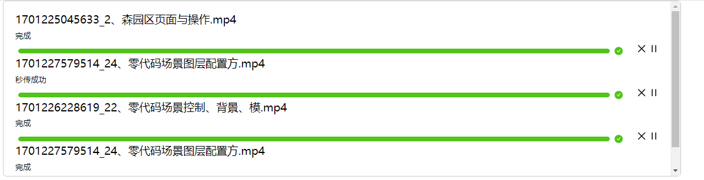

# BigFileUpload-Solution

> 经典的大文件上传解决方案，最终实现的效果如下：
> </br>
> 
>
> 这是“大文件分片上传” 的解决方案, 而不是一种插件，所以下面的流程会引导您如何进行配置。

### 1. 任务

> 其中的功能实现大部分了，已经在生产环境中运行了，后续新的功能会不断添加。

- [x] 大文件切割上传
- [x] 秒传
- [x] 断点续传
- [x] 并发控制
- [x] 暂停
- [x] 相同文件互斥上传
- [ ] 网络中断
- [x] 删除
- [x] 失败重试
- [x] Hash摘要算法 队列
- [ ] 持久化方案(基于本地缓存)
- [ ] 刷新留存
- [ ] 基于 DB 的持久化方案(???)

### 2. 代码实现demo

> 目前现有的demo 是基于 Vue3 + Java 实现的，地址如下：

- [前端代码](https://gitee.com/li_haohao_1/big-file-upload_front)
- [后端代码](https://gitee.com/li_haohao_1/big-file-upload_end)

接下来演示下，如何将 大文件切片上传的方案 引入到您的工程中

### 3. 如何部署（基于Vue的，React可以自行修改）

#### 3.1. 部署文件[calculateNameWorker.js]

可以在前端工程中找到文件[calculateNameWorker.js], 然后在 index.html 中采用 cdn
的方式引入。
</br>
[参照 demo](https://gitee.com/li_haohao_1/big-file-upload_front/tree/master/public)

#### 3.2. 引入上传插件的核心

> 该插件 跟技术栈无关的，无论是Vue 还是 React都可以引入该插件。

将 [uploader 文件夹](https://gitee.com/li_haohao_1/big-file-upload_front/tree/master/src/utils/uploader)
直接复制到您的工程中。
如果目录结构是保持一致的, 您几乎不需要修改任何东西。即使目录结构不一致，您只需要修改下文件引入路径即可

#### 3.3. 引入基于Vue3 的Hook 钩子

> 该 Hook 插件是基于Vue3 封装的，写法非常简单。完全可以自己根据需求来封装React版本的代码。

[这里是 Hook 地址参数](https://gitee.com/li_haohao_1/big-file-upload_front/tree/master/src/hooks)

### 4. 配置修改

```javascript
import {uploadHandler, UploadProgressState} from "@/utils/uploader";

uploadHandler.config({
    // 错误请求，重试次数
    maxRetryTimes: 3,
    // 限制最大并发数
    concurrentLimit: 3
});
```

我们调用上述方法`uploadHandler.confg` 来修改 大文件上传 的配置

### 5. server端 提供的接口

> 因为必须是前后端联动，所以有必要知道后端需要提供哪些接口，[具体的地址参数](https://gitee.com/li_haohao_1/big-file-upload_front/blob/master/src/api/upload/index.ts)
，但是我们只会介绍下 特殊的参数意义，其他的参照demo就可以

- 方法`sectionUploadReq` 参数`baseDir` 其实是
  Hash摘要算法值，就是通过文件[calculateNameWorker.js] 计算的值(不包括后缀)
- 方法`mergeUploadReq` 参数`baseDir` 同 第一条
- 方法`verifyFileExistReq` 参数`fileName` 是 Hash摘要算法值
- 方法`listFilesReq` 参数`baseDir` 同 第一条

### 6. 扩展点

- web worker 子线程开启 Hash摘要算法, 为了避免大文件并发计算，内嵌了队列实现
- 并发控制 上传文件(手写 p-limit 实现)

### 7. QA

#### 7.1. 如何查看每个进度的状态呢???

```typescript
/* 进度状态 */
export enum UploadProgressState {
    // 准备中 计算唯一的hash码
    Prepare = "Prepare",
    // hash 计算等待中
    HashCalculationWaiting = "HashCalculationWaiting",
    // 上传等待中 目的是为了并发控制
    Waiting = "Waiting",
    // 上传中
    Uploading = "Uploading",
    // 表示合并文件中
    Merge = "Merge",
    // 上传完成
    Done = "Done",
    // 秒传
    QuickUpload = "QuickUpload",
    // 断点 续传
    BreakPointUpload = "BreakPointUpload",
    // 表示 其他元素上传中
    OtherUploading = "OtherUploading",
    // 暂停 状态
    Pause = "Pause",
    // 暂停 重试
    PauseRetry = "PauseRetry",
    // 被 取消状态
    Canceled = "Canceled",
    // 重试状态
    Retry = "Retry",
    // 网络失联
    NetworkDisconnected = "NetworkDisconnected",
    // 重试失败
    RetryFailed = "RetryFailed",
}
```

